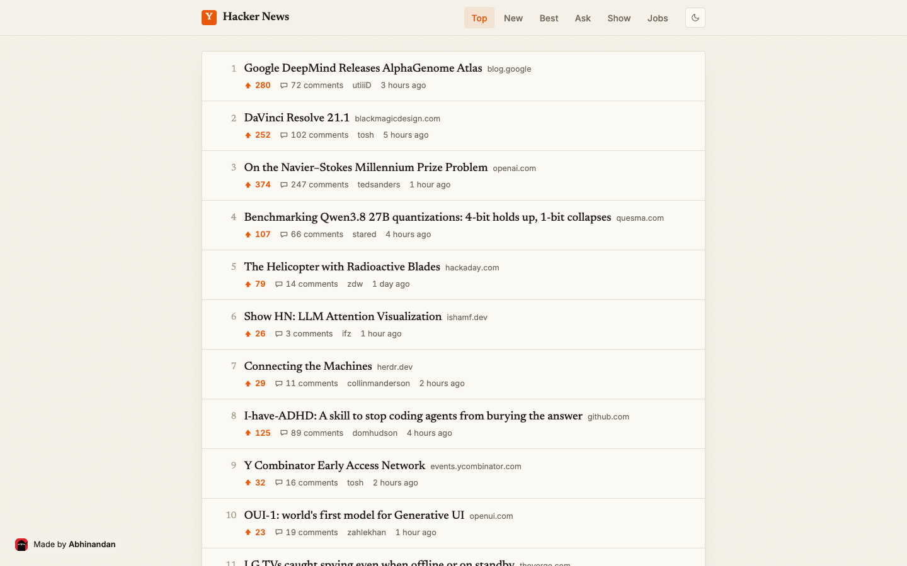
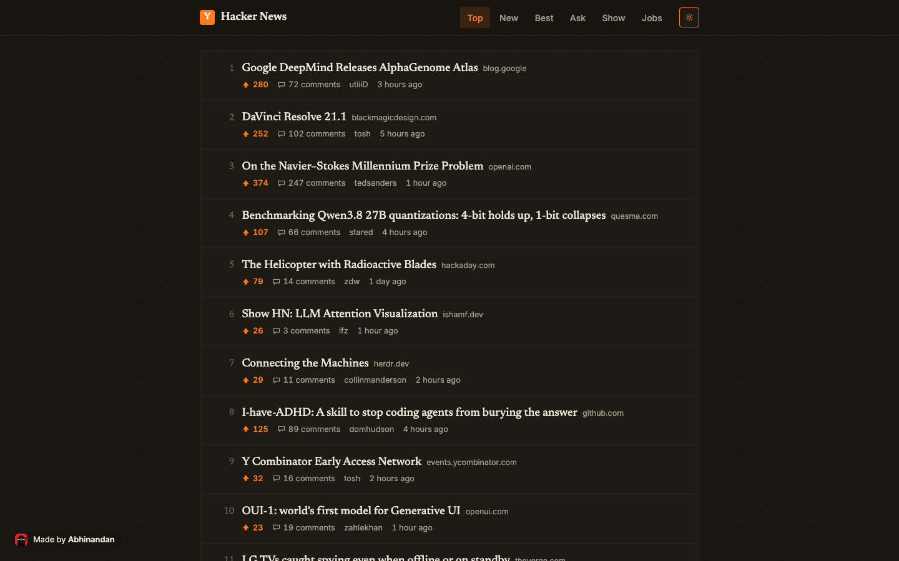

# Hacker News Reader

A paper-themed Hacker News reader on the Next.js App Router: Top, New, Best, Ask, Show and Jobs feeds from the
official Firebase API, fetched in the browser with a small cache, 30 stories a page with
working pagination, relative timestamps, and a dark mode that remembers itself.

**Live:** https://abhinandansharma.github.io/hacker-news-clone/





## Stack

Next.js 15 (static export), React 19, TypeScript, Tailwind CSS, Heroicons.

## Run it

```bash
npm install
npm run dev      # http://localhost:3000/hacker-news-clone
npm run build    # static export to out/
```

Deployed to GitHub Pages by `.github/workflows/pages.yml` on every push to main.
